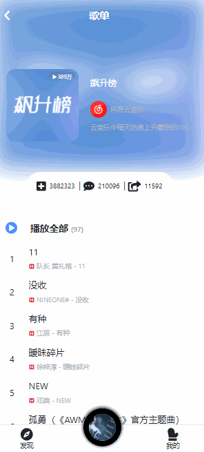
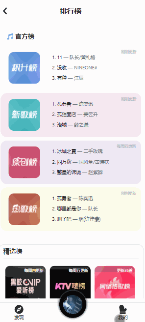
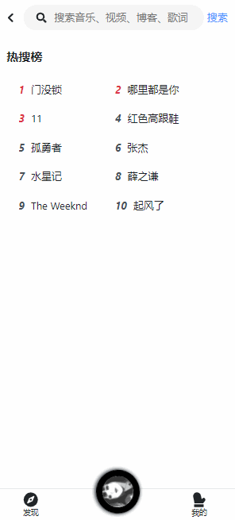
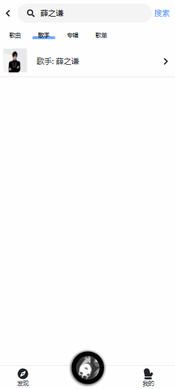

# Melodia

<!-- Badge -->


<!-- PROJECT LOGO -->
<br />
<p align="center">
  <a href="https://github.com/Censwin/melodia-ts/">
    
  </a>

  <h3 align="center">Melodia</h3>

  <p align="center">
    一个精美的移动端音乐平台
    <br />
    <a href="https://censwin.github.io/melodia-ts/"><strong>在线示例</strong></a>
    ·
    <a href="https://github.com/Censwin/melodia-ts/issues/new"><strong>提交 bug</strong></a>
    <br />
  </p>
</p>

## 项目介绍

Melodia （意大利语： 旋律），是一个移动端音乐平台，集成了音乐播放、搜索、歌单、推荐、排行榜 等功能，可以免去下载app的烦恼；  

本项目缘起自三元大佬，在学习了TS后萌生了重构的想法，同时也是对自己近来学习成果的一次实践

本项目做了更多的完善，包括 TS 重构、hook 的使用、 所有界面的重新设计、使用 Redux-Saga 替代 Redux-thunk、使用更轻量化的 immer 提供 data-immutable、使用了vw提供了自适应、使用 scss 提供全局属性函数及动画、加入了 ui 组件库的设计理念（详见/components）

## 展示

<h3 align="center">首页</h3>
<p align="center"></p>

<h3 align="center">歌单列表</h3>
<p align="center"></p>

<h3 align="center">歌单详情</h3>
<p align="center"></p>

<h3 align="center">排行榜</h3>
<p align="center"></p>

<h3 align="center">搜索</h3>
<p align="center"></p>

<h3 align="center">歌手</h3>
<p align="center"></p>

<h3 align="center">播放器（点击CD切换歌词）</h3>
<p align="center"></p>

## 问题

该项目依然有很多问题待解决，可能有些地方不正确、不规范、体验差等也请大家指出

## 开发

### Install

```
npm install
```

### Usage

```
npm run start
```

## 项目结构

```
├─application           // 项目核心功能
├─assets                // 静态文件
├─baseUI                // 通用 UI 模板
├─components            // 通用型功能组件
├─hooks                 // 自定义hook
├─routes                // 路由配置文件
├─services              // api
├─store                 // store 配置
├─styles                // scss 全局配置
└─utils                 // 工具函数
  App.js                // 根组件
  index.js              // 入口文件
  config-overrides      // webpack 配置
```


## 规划

1. 登录
2. 收藏
3. 历史

